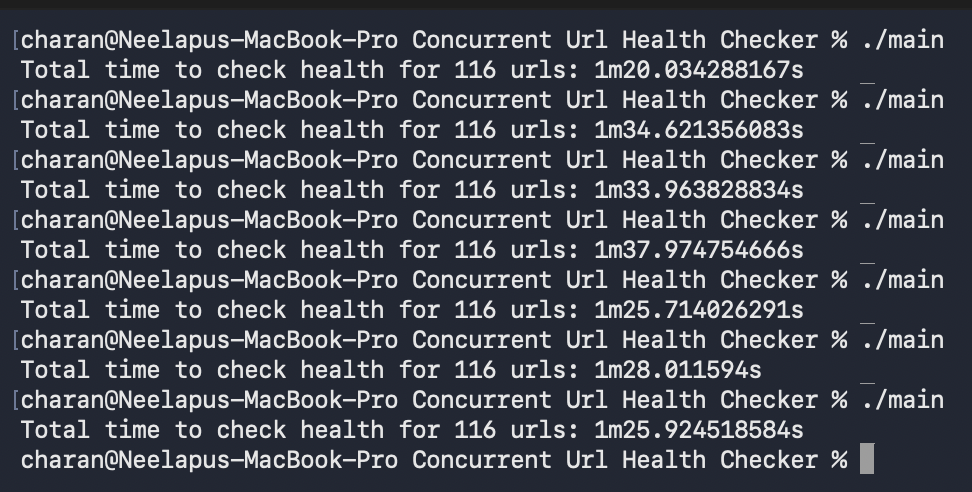
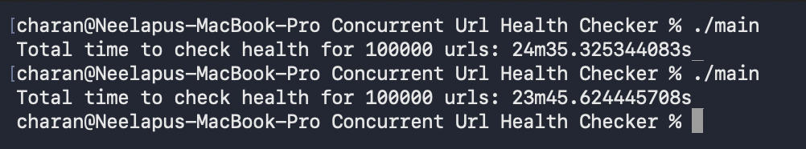
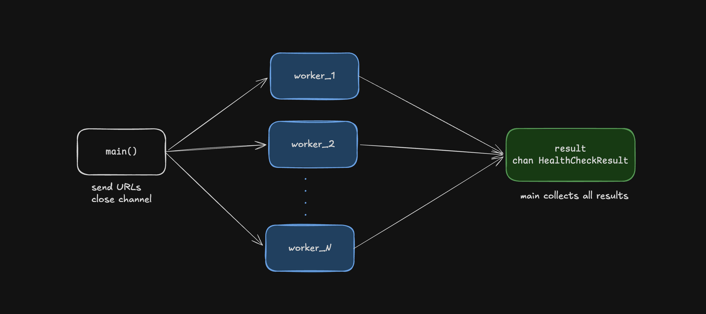
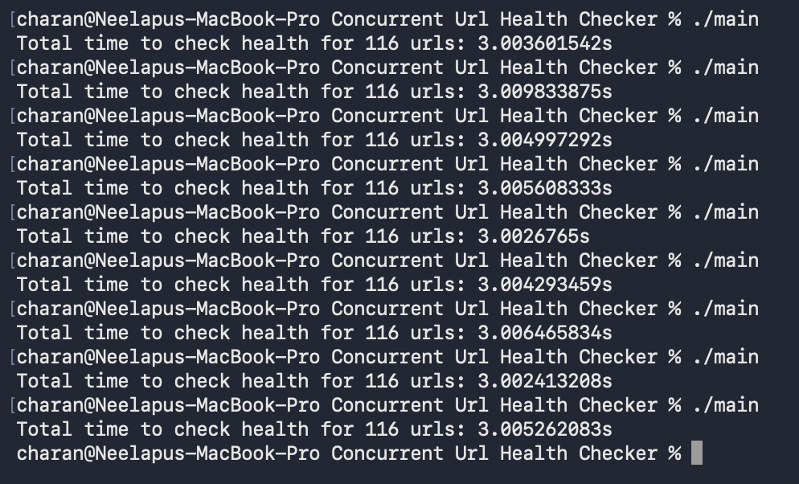
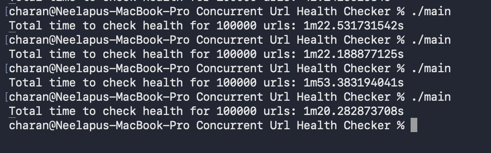
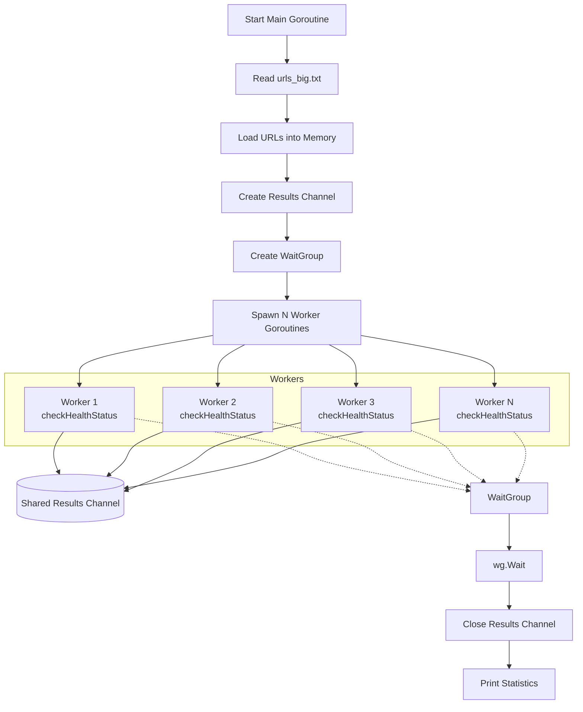
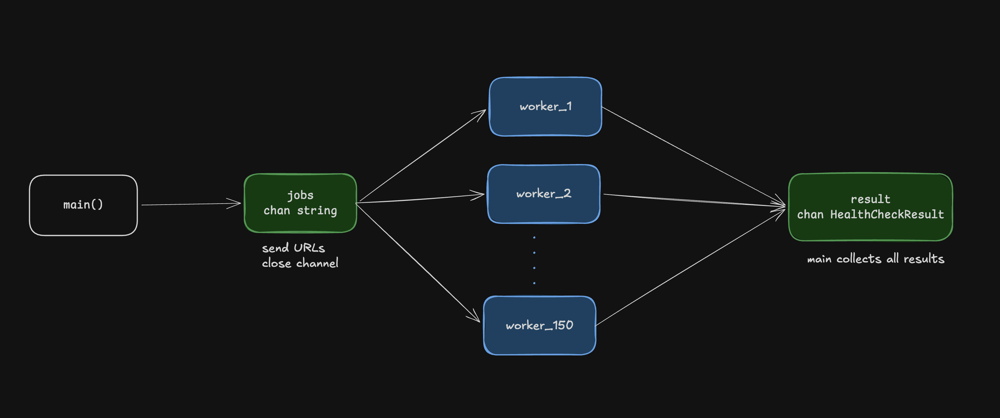
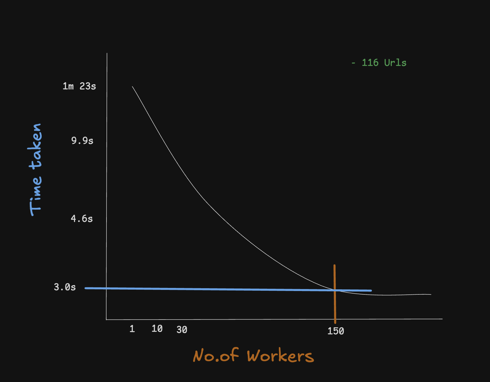

# Concurrent URL Health Checker

<video width="100%" controls>
  <source src="./images/cursorful-video-1781357667481.mp4" type="video/mp4">
</video>

A lightweight and efficient URL Health Checker built with Go that performs concurrent health checks on multiple websites and APIs. The application leverages Go's goroutines and channels to send parallel HTTP requests, significantly reducing the time required to monitor large sets of URLs.

The tool validates URL availability by checking HTTP response status codes, response times, and connectivity, providing a quick overview of service health. Its concurrent architecture ensures scalability and optimal resource utilization, making it suitable for monitoring web services, APIs, and infrastructure endpoints.


## Phase 1: Reading Data From File
I am using `os.ReadFile()` to read the entire file and parsed the content byte by byte.
- It takes the entire file and stores it in the memory

### Benchmarks
| Metric | Value |
|---------|---------|
| Number of URLs | 115 |
| Average time | 814 microseconds |
| Memory Usage | 0.0028762 MB ~ 2Kb |

| Metric | Value |
|---------|---------|
| Number of URLs | 100000 |
| Average time | 100 milliseconds |
| Memory Usage | 2.4768 MB ~ 2Mb |


## Phase 2: Changed the URL from string to byte type
In Go `string` are immutable, it means its bytes cannot be modified
 - Before i am using `string` type for the `url` variables, so when ever i append a new character to it, go create a new string and copy all the values into the new string and discards the old string
- `slices` are mutable so when we append data to `byte[]` array it dont create a new byte[] everytime until capacity runs out.

### Benchmarks
| Metric | Value |
|---------|---------|
| Number of URLs | 100000 |
| Average time | 30 milliseconds |
| Memory Usage | 2.4768 MB ~ 2Mb |

## PHASE 3: Optimized File Reading
Before we are loading the entire file data into memory so that's the reason the memory usage for reading teh file is `2Mb` which the size fo the file.
- I have changed `os.ReadFile()` to `os.Open()` it gives an pointer to that file instead of loading the entire data, using that pointer we read the data line by line.

### Benchmarks
| Metric | Value |
|---------|---------|
| Number of URLs | 100000 |
| Average time | 12.55 milliseconds |
| Memory Usage | 0.00402 ~ 4Kb |


## Phase 1: Checking URLs Health
Making request to each api endpoint which are fetched from the file.

### Benchmarks
| Metric | Value |
|---------|---------|
| Number of URLs | 116 |
| Average time | 1.28 m |



### Benchmarks
| Metric | Value |
|---------|---------|
| Number of URLs | 100000 |
| Average time | 23.9 m |



## Phase 2: Parallelize Health Checking Job
Before we are sending request to each API endpoint sequentially, since all are independent jobs, we can split this work using `goroutines` which create a lightweight threads, all those run parallely.



### Benchmarks
| Metric | Value |
|---------|---------|
| Number of URLs | 116 |
| Average time | 3 sec |



### Benchmarks
| Metric | Value |
|---------|---------|
| Number of URLs | 100000 |
| Average time | 1.21 m |



# Architecture



## Phase 3: Fixed workers and reuse the workers
Before we are creating `goroutine` for each url, if there are `1,00,000` urls it created that many goroutines, but this can create memory overhead, cause each goroutine starts with `2Kb` of stack size and dynamically it increases the size, therefore
```
2Kb * 100000 = 200MB
```
and it creats `scheduling overhead`.

Go does not create 100,000 OS threads.

Instead, Go uses its scheduler based on the G-M-P model:

- G (Goroutine) = your function execution
- M (Machine) = an OS thread
- P (Processor) = a logical scheduler context

`runtime.GOMAXPROCS(0)` gave `8` -> it means Go can execute 8 threads simultaneously





### Benchmarks
| Metric | Value |
|---------|---------|
| Number of URLs | 116 |
| Average time | 3 s |

### Benchmarks
| Metric | Value |
|---------|---------|
| Number of URLs | 100000 |
| Average time | 27s |
